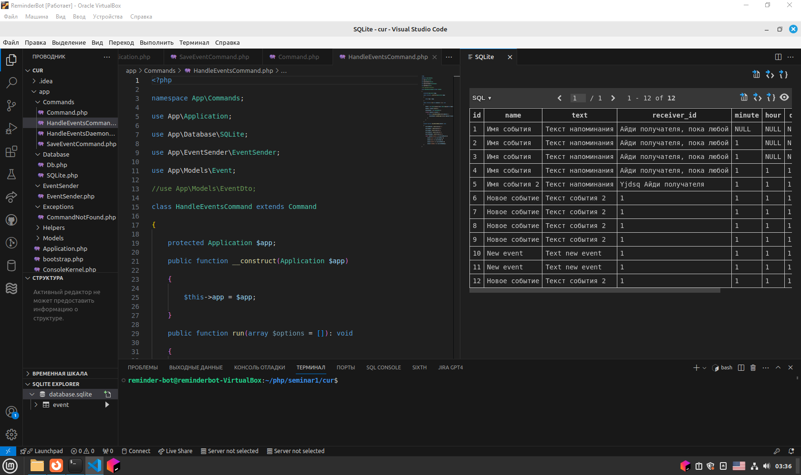
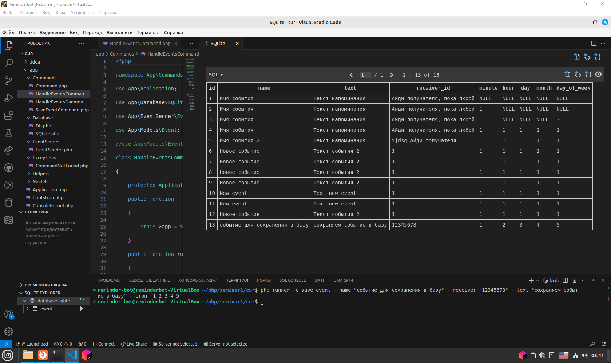
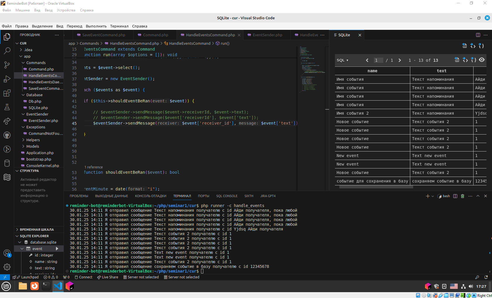
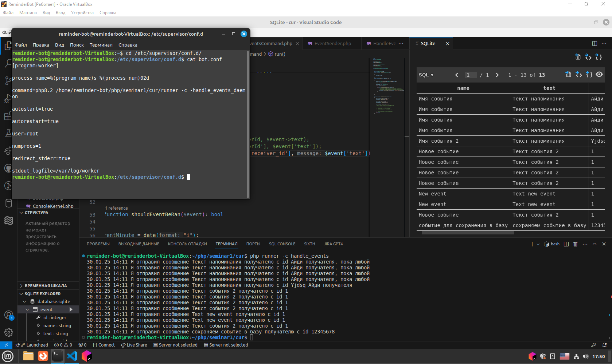

# reminger-tg-bot

## Семинар 1

### Добавляем запись в базу данных по команде save_event

---

---

### Рассылаем все записи из базы данных вручную с помощью команды php runner -c handle_events

### Конфигурация бота в супервизоре в /etc/supervisor/conf.d/bot.conf

